# MiniK8s

## 1. Project Overview

Project repository address: https://github.com/GMH233/mini_k8s

### 1.1 Overall Project Architecture

The implementation architecture of the MiniK8s project refers to the architecture of Kubernetes. There is a single master node and several worker nodes in the cluster. The apiserver provides APIs for users and all other cluster components. The configuration/status of the cluster is stored in etcd, and other cluster components obtain the required information through the apiserver.

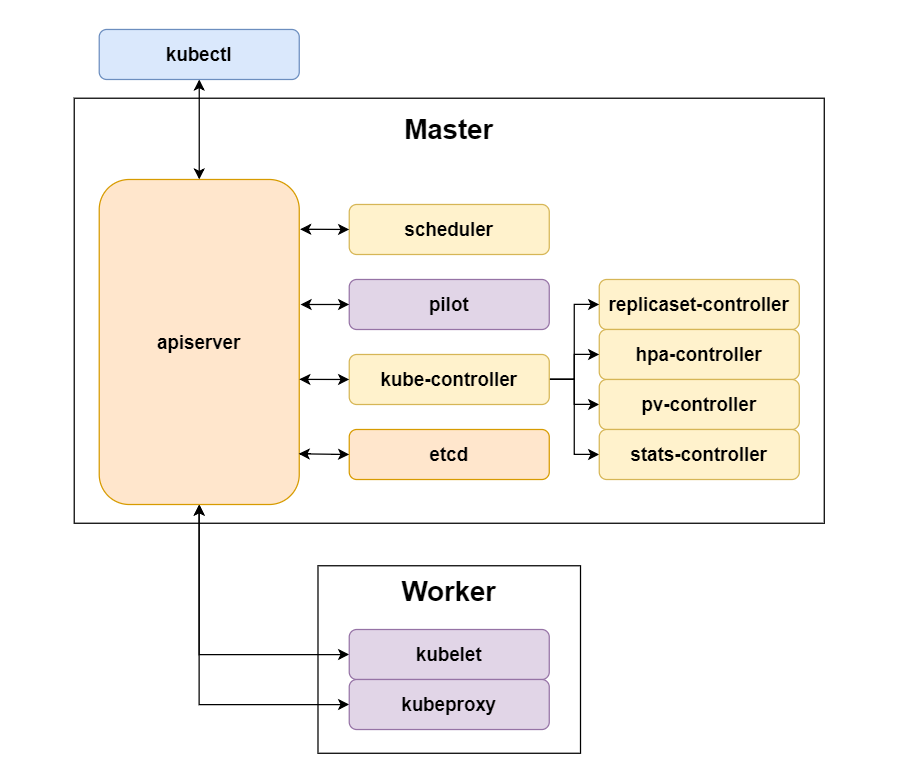

### 1.2 Brief Description of Key Project Components

- **kubelet**: Listens to the apiserver to create Pods on the node as requested and manages the Pod lifecycle.
- **kube-proxy**: Configures DNS and Services.
- **envoy**: The sidecar proxy of the service mesh, which hijacks traffic and routes it based on routing configurations.
- **pilot**: The control plane component of the service mesh, calculating routing configurations in real-time.
- **scheduler**: Responsible for scheduling Pods to different worker nodes in the cluster.
- **apiserver**: Responsible for information exchange between various components, providing a unified API, and implementing etcd persistence.
- **controller-manager**: Responsible for managing various resources within the cluster, such as ReplicaSets, HPAs, etc.

### 1.3 Software Stack and Open Source Libraries

#### 1.3.1 Software Stack

The main body of this project is developed using Golang, with Go language version 1.22. The version of the Kubernetes reference source code is 1.30.

Docker provides good support for the Go language and offers many APIs, facilitating the retrieval of the underlying state of containers.

The API interface of MiniK8s is based on Kubernetes 1.30 and has been modified according to actual requirements.

The specific software stack is as follows:

| **Function**                     | **Component Used** |
| -------------------------------- | ------------------ |
| Persistent Storage               | etcd               |
| Container Runtime Interface      | docker             |
| CNI Plugin                       | weave              |
| DNS Server                       | coredns            |
| Reverse Proxy                    | nginx              |
| Container Performance Monitoring | cadvisor           |

#### 1.3.2 Main Open Source Libraries

| **Function**                        | **Address**                                                  |
| ----------------------------------- | ------------------------------------------------------------ |
| API Server Framework                | [github.com/gin-gonic/gin](https://github.com/gin-gonic/gin) |
| Docker SDK for Docker Interaction   | [github.com/docker/docker](http://www.github.com/docker/docker) |
| iptables Rule Management            | [github.com/coreos/go-iptables](http://www.github.com/coreos/go-iptables) |
| IPVS Rule Management                | [github.com/moby/ipvs](http://www.github.com/moby/ipvs)      |
| CLI Tool for Parsing Terminal Input | [github.com/spf13/cobra](http://www.github.com/spf13/cobra)  |
| Go YAML File Parsing                | [gopkg.in/yaml.v3](https://gopkg.in/yaml.v3)                 |
| UUID Generation                     | [github.com/google/uuid](github.com/google/uuid)             |
| cAdvisor Client                     | [github.com/google/cadvisor/client/v2](github.com/google/cadvisor/client/v2) |
| cAdvisor Information Format         | [github.com/google/cadvisor/info/v2](github.com/google/cadvisor/info/v2) |
| etcd Client                         | [go.etcd.io/etcd/client/v3](go.etcd.io/etcd/client/v3)       |
| Kubeproxy Netlink                   | [github.com/vishvananda/netlink](github.com/vishvananda/netlink) |

## 2. Project Contributions and Division of Labor

Please refer to the Chinese document.

## 3. Project Management and Development

### 3.1 Branch Management

There are mainly three types of branches:

- **main branch**: The branch where the finished product resides.
- **dev branch**: After new features pass local testing, they are merged into the dev branch via PR for CI/CD testing and feature integration.
- **feature/\* branches**: Branches for independently developed features.

### 3.2 Testing and CI/CD

#### 3.2.1 Testing

For **environment-independent modules** (such as utility functions, third-party tools, etc.), `*_test.go` files were written and automatically tested via the `go test` command.

For **components dependent on software and network environments**, major components are tested within the `./test` folder, or compiled and tested separately according to requirements.

We adopt a separation of development and testing. We develop on local machines utilizing IDE features, and then synchronize the source code to the server for actual execution and testing.

#### 3.2.2 CI/CD

After passing local tests on the server, we upload the successfully tested branches to GitHub. Using GitHub Workflow, CI/CD processes are triggered upon pushing or creating a PR to the dev branch. The environment is fully initialized before each run via custom testing scripts.

Changes to the dev branch are only considered valid if they pass the CI/CD tests.

### 3.3 New Feature Development Workflow

#### 3.3.1 Development Mode

The advancement of the project utilizes a combination of **API-driven** and **rapid iterative development**.

For new features, after requirement analysis, we design the API objects, followed by the corresponding interfaces. We then write the operational logic code specifically for these interfaces.

Interfaces are uniformly managed using Postman and shared among team members.

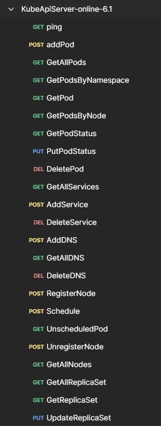

Once all interfaces pass testing, we write the corresponding kubectl logic.

In terms of iteration, we develop according to the project iteration plan, with a 2-week iteration cycle. Every weekend, if there are issues related to the current iteration, they are resolved centrally face-to-face to minimize rework.

#### 3.3.2 Pace of Development

Our development strictly follows the iteration plan, with one iteration every 2 weeks.

Development is concentrated on Mondays, Fridays, and Saturdays each week, allowing for on-site communication if difficulties arise.

By the 16th week prior to the defense, we had completed all required contents, basically aligning with planned expectations.

## 4. System Architecture and Component Functions

### 4.1 Kubelet

The Kubelet runs on every worker node and is primarily responsible for the creation and deletion of Pods on its node, monitoring and managing the Pod lifecycle, and syncing/reporting Pod status. Specifically, the implementation methods for the main functional points of Kubelet are as follows:

1. **Pod Creation and Deletion**: The Kubelet periodically queries the control plane for all Pod configurations on its node. By comparing this with the latest local cache, it calculates all configuration changes (i.e., Pod additions/deletions) within a polling cycle and invokes the container runtime interfaces to perform the corresponding operations.
2. **Pod Lifecycle Monitoring and Management**: The Kubelet process includes a PLEG (Pod Lifecycle Event Generator) sub-goroutine. It periodically queries the container runtime interface to obtain the runtime status of all Pods and compares it with the latest cache. If the new and old states are inconsistent, it generates corresponding lifecycle events to notify the main goroutine. The main goroutine decides how to respond based on the event type (for instance, if a restart policy is specified, upon receiving a `ContainerDied` event, a container restart operation will be executed).
3. **Pod Status Syncing and Reporting**: Upon receiving lifecycle events, the Kubelet sends the latest Pod status from its local cache to the apiserver. Additionally, the Kubelet periodically sends collected container metrics (CPU, memory usage, etc.) back to the apiserver via a timer.

To support the implementation of these functions, the overall architecture of Kubelet is as shown in the figure:

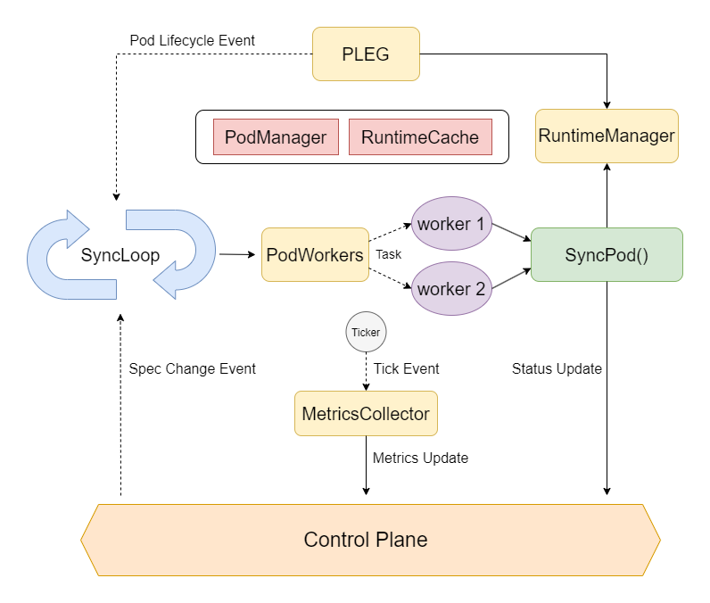

In the figure, solid arrows represent function calls, and dashed arrows represent event propagation. The functions of the sub-components are as follows:

- `pod.Manager`: Provides an interface for the local cache of Pod Specifications.
- `runtime.Cache`: Provides an interface for the local cache of Pod Statuses.
- `runtime.RuntimeManager`: An encapsulation layer for the Docker SDK, wrapping container-level operations into Pod-level operations. It provides interfaces such as `AddPod`, `DeletePod`, and `GetPodStatus`.
- `pleg.PLEG`: Periodically computes Pod lifecycle events and sends them to the main goroutine.
- `metrics.MetricsCollector`: Continuously fetches container metrics via cAdvisor and sends them to the control plane.
- `kubelet.PodWorkers`: Assigns a worker goroutine to each Pod and provides an interface for the main goroutine to delegate tasks to worker goroutines (asynchronous tasks to shorten the blocking time of the main goroutine and reduce latency).

As can be seen, the Kubelet main goroutine is essentially an event loop that listens for configuration changes, lifecycle events, timed tasks, etc., and performs corresponding operations. The goroutine + channel features of the Go language provide great convenience for implementing an event loop.

### 4.2 Kubeproxy

Kubeproxy also runs on each worker node and is primarily responsible for:

1. Based on the Service configurations in the cluster, forwarding traffic on the local node, enabling users to access the actual providers (Endpoints) of the Service via the Service's virtual IP (Cluster IP) or node port (NodePort).
2. Based on the cluster DNS configuration, configuring the DNS nameserver on the local node to provide to Pods and the host machine. Since the URL path is an HTTP-layer concept, to support directing different paths to different services, an HTTP reverse proxy is also configured.

In this project, Kubeproxy utilizes Linux IPVS for traffic forwarding, uses coredns as the DNS server, and nginx as the reverse proxy. Implementation details of Service and DNS are found in Section 5.

### 4.3 Envoy/Pilot

Envoy is a sidecar proxy injected into every Pod within a sidecar-architecture-based service mesh, while Pilot is the control plane component of the service mesh. Users can declaratively specify traffic forwarding rules between microservices. Based on this, Pilot calculates and generates a routing table (called `SidecarMapping`), which contains the mappings from `(ServiceIP, Port)` to `[(EnpointIP, TargetPort, weight/URL)]`. Envoy then hijacks all inbound and outbound traffic of the Pod and forwards it through this routing table.

The service mesh architecture in this project is as follows:

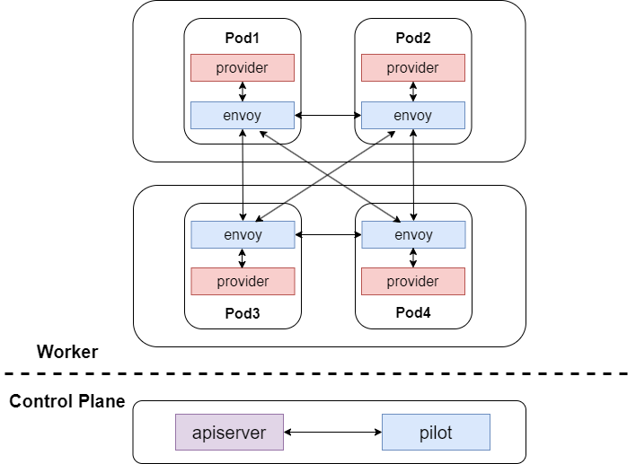

### 4.4 Scheduler

The Scheduler is a control plane component responsible for scheduling unscheduled Pods to appropriate nodes. Currently, the Scheduler supports three strategies:

1. **Round Robin**: Schedules Pods to different nodes in a rotational manner.
2. **Random**: Randomly selects a node for scheduling.
3. **Node Affinity**: Matches based on the `label` fields in the Pod and Node configuration files, prioritizing scheduling the Pod to a matching Node. Otherwise, it matches randomly.

In this project, the mapping relationship between a Pod and its corresponding Node is stored separately in etcd to facilitate quick queries of all Pods on a specified Node.

### 4.5 API Server

The API Server is the hub for all API interactions and the core of the control node.

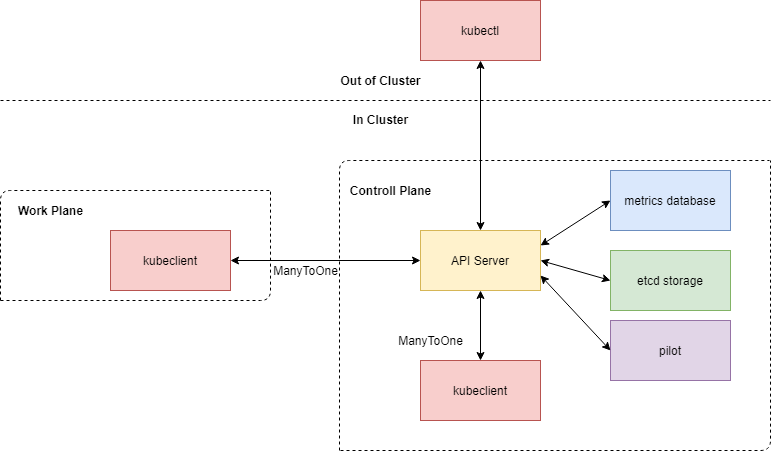

The API Server is primarily responsible for:

1. Exposing API endpoints for use by other components.
2. Interacting with etcd to achieve persistence.
3. Receiving Pod monitoring data from the kubelet.

The API Server is implemented using the Gin framework. It implements a series of RESTful API endpoints, binding each `URL + Method` request to a handler function.

Handler functions appear in groups and mainly process the following types of API objects:

- Node queries, registration, and deregistration.
- CRUD operations for Pods, Pod status queries and modifications, and Pod scheduling.
- CRUD operations for Services.
- CRUD operations for DNS.
- CRUD operations for ReplicaSets.
- Creating, querying, and deleting Pod statistics.
- CRUD operations for HPAs.
- CRUD operations for VirtualServices.
- CRUD operations for Subsets.
- CRUD operations for SidecarMappings.
- CRUD operations for RollingUpdates.

We designed a generic structure for Request Messages within the cluster, capable of returning different types of data; if an error occurs during the process, specific error information can be included within the message.

### 4.6 Controller Manager

Controllers manage higher-level abstractions, and the ControllerManager uniformly manages these various Controllers.

Upon startup, the ControllerManager launches each Controller as a sub-goroutine.

- **ReplicaSetController**: Polls all ReplicaSets and Pods in the cluster to calculate the number of available Pods based on label selectors.
- **HPAController**: Evaluates whether scaling up or down is necessary based on metrics from Pods managed by its associated ReplicaSet and specific scaling policies.
- **PVController**: Polls PVs and PVCs in the cluster to achieve cluster-level persistent storage.
- **StatsController**: Dynamically generates Prometheus-readable configuration files based on the information of each node and the information of Pods with custom metrics.

### 4.7 Kubectl

As the command-line tool for MiniK8s, Kubectl interacts with the control plane to accomplish functions like querying, deploying, and deleting API objects.

Kubectl uses Cobra to beautify command-line operations and improve command-line parsing efficiency.


The commands supported by kubectl are as follows:

**Querying**

- `kubectl get [APIObject]`: Get information on all objects of a certain type.
  - For convenience, both singular and plural forms of APIObject are accepted.

**Deployment**

- `kubectl apply -f /path/to/yaml`: Parses the corresponding type from the yaml file and deploys it.
  - If there is a parsing error, a marshal error will be prompted.
  - If there is a deployment error, the specific error returned from the apiserver will be displayed.

**Deletion**

- `kubectl delete -f /path/to/yaml`: Deletes the object based on the type, name, and namespace in the yaml file.
  - Does not strictly check the yaml format.
- `kubectl delete [APIObject] [name]`: Deletes the object corresponding to the name in `namespace = default`.
- `kubectl delete [APIObject] -p [namespace] -n [name]`: Specifies the namespace and name to delete the object.

**Description**

- `kubectl describe [APIObject] [name]`: Describes the object corresponding to the name in `namespace = default`.
- `kubectl describe [APIObject] -p [namespace] -n [name]`: Specifies the namespace and name to describe the object.
  - Provides more detailed information.
  - Can conveniently add functionality to output the original JSON of the object.

### 4.8 Kubeclient

As a functional component interacting with the API Server, Kubeclient is not exposed to the outside but is solely used by various components within the cluster.

Any component that needs to interact with the API Server will bind to a Kubeclient. Thus, Kubeclient has a complete set of interfaces.

## 5. Feature Implementation Details

### 5.1 Pod Abstraction

A Pod is an abstraction of a group of co-working containers. Containers belonging to the same Pod share the same network namespace and can access each other via localhost. They can also share files by specifying the creation and mounting of storage volumes. Furthermore, a Pod is the smallest unit managed by other advanced features in MiniK8s (such as Service / MicroService, ReplicaSet / HPA, Scheduler, etc.).

The contents of a Pod configuration file include: Pod name, containers (including image, command, exposed ports, volume mount points, resource usage, security context), storage volumes (including volume name, volume type), init containers (exit after running), and restart policy (currently supporting None and Always). An example is as follows:

```yaml
apiVersion: v1
kind: Pod
metadata:
  name: test-pod
  namespace: default
spec:
  containers:
    - name: python
      image: python:latest
      command: ["python", "-m", "http.server", "8000"]
      ports:
        - containerPort: 8000
          protocol: tcp
      volumeMounts:
        - name: volume1
          mountPath: /mnt/v1
      resources:
        limits:
          cpu: 500m
        requests:
          cpu: 100m
      securityContext:
        privileged: true
  initContainers:
    - name: init
      image: python:latest
  volumes:
    - name: volume1
      emptyDir: {}
  restartPolicy: Always
```

Below is a detailed explanation of how the Pod abstraction is implemented through a Pod's lifecycle:

1. **From Pod Creation to Cluster Visibility**
   - When a user creates a Pod using `kubectl apply`, the apiserver validates the parameters and stores it in etcd. At this point, the Pod's status field is empty, and it is in an unscheduled state. The Scheduler retrieves this unscheduled Pod during its polling and initiates a scheduling request to the apiserver based on a certain scheduling strategy. At this point, a new Node-to-Pod mapping is added to etcd. The Kubelet retrieves the Pod via the `GetPodByNode` interface, updates the Pod Spec cache, creates a worker goroutine, and invokes the `AddPod` interface of the `RuntimeManager` within the worker goroutine.
   - Inside `AddPod`, to enable containers to share the network namespace, a Pause container is first created, and the network mode of other containers is set to `container` mode. Thus, all containers share the network namespace with the Pause container. Other operations for container creation can be achieved directly by calling the Docker SDK (exposing ports, mounting volumes, etc.).
   - During its periodic Relist loop, PLEG retrieves the runtime status of all containers within the Pod via the `GetPodStatus` interface of `RuntimeManager`. Since a new Pod has started, it detects that the status acquired differs between two Relists. It then updates the latest status to the Pod Status cache, calculates the lifecycle event `ContainerStarted` based on the old and new states, and sends it to the main goroutine. The main goroutine reports the status from the cache back to the apiserver, making the Pod's status visible throughout the cluster.
2. **Pod Deletion by the Cluster**
   - The user can delete a Pod using `kubectl delete`. The apiserver will then directly delete all data relating to this Pod in etcd. The Kubelet subsequently detects a change in the Pods on its node, triggering a deletion operation: it deletes the Pod Spec cache and uses the `DeletePod` interface of `RuntimeManager` to clean up all containers belonging to that Pod (including the Pause container).
   - PLEG detects that containers are removed and sends a `ContainerRemoved` event. However, since the local Pod Spec cache no longer contains an entry for this Pod, the event is logged and ignored.
3. **Container Exit Within a Pod**
   - PLEG detects a container exit and sends a `ContainerDied` event. If the Pod's restart policy is `None`, the main goroutine recalculates the Pod's API status (i.e., the status provided to the cluster) based on the latest Pod Status cache—which might be `Running` (other containers have not exited), `Succeeded` (exit code is 0), or `Failed` (exit code is non-zero)—and sends it to the apiserver.
   - If the Pod's restart policy is `Always`, the main goroutine calls the `RestartPod` interface to attempt to restart the entire Pod.

The aforementioned exit handling strategies are illustrated in the following diagram:

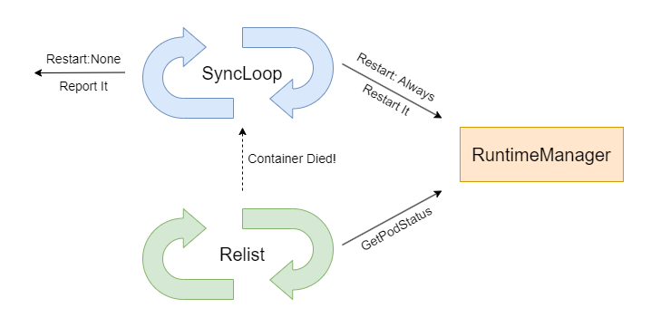

### 5.2 CNI

In this project, the CNI plugin selected is weave, and the calls to CNI are integrated into the Pod functionalities. When `RuntimeManager` creates a Pod, it calls `weave attach` to assign an IP to the Pause container. Due to the shared network namespace, all containers eventually possess this IP.

In a multi-node scenario, new machines need to call `weave connect` to join the weave cluster. Thereafter, the IP assigned by `weave attach` will be visible across all worker nodes.

### 5.3 Service Abstraction

A Service is an abstraction of the network service exposed by a group of Pods. Once a user creates a Service in the cluster, they can access the real network service via its virtual IP. This abstraction shields the IP and other information of the specific network service providers, and it is managed by Kubeproxy.

The contents of a Service configuration file include: Service name, label selector, type (supporting ClusterIP and NodePort), and a set of virtual ports with their corresponding actual ports. An example is as follows:

```yaml
kind: Service
apiVersion: v1
metadata:
  name: nginx-service
spec:
  type: NodePort
  ports:
    - port: 800
      targetPort: 1024
      nodePort: 30080
  selector:
    app: nginx
```

Once the request to create a Service reaches the apiserver, the apiserver will allocate a ClusterIP for it from an IP pool within a reserved subnet (100.0.0.0/24). The specific implementation involves persisting a bitmap in etcd, where each bit corresponds to the occupancy of an IP in the pool. Allocation is done by finding an available IP via the bitmap and flipping the corresponding bit.

In this project, Kubeproxy uses Linux IPVS for traffic forwarding. First, Kubeproxy performs necessary initializations upon startup to ensure IPVS traffic forwarding functions correctly under every usage scenario, including Pod-to-Pod access, host-to-Pod access, and Pod-to-self access. The equivalent commands are as follows (the verbose roles of kernel modules and system parameters are omitted here):

```bash
modprobe br_netfilter
ip link add dev minik8s-dummy type dummy
sysctl --write net.bridge.bridge-nf-call-iptables=1
sysctl --write net.ipv4.ip_forward=1
sysctl --write net.ipv4.vs.conntrack=1
```

The fundamental concepts of IPVS traffic forwarding are Virtual Server and Real Server, which heavily overlap with the Service abstraction. When configuring rules for a Service (specifically, one of its Ports), the Virtual Server is set to ClusterIP:Port, and its destination Real Servers are set to the PodIP:TargetPort of all Endpoints for that Service. To support NodePort, an additional Virtual Server is simply added, namely HostIP:NodePort, with its destination Real Servers remaining identical to those previously described.

The load-balancing strategy for the Service is also provided by IPVS; Round Robin is selected for this project.

In summary, the IPVS rules corresponding to the example Service should look like the diagram below:

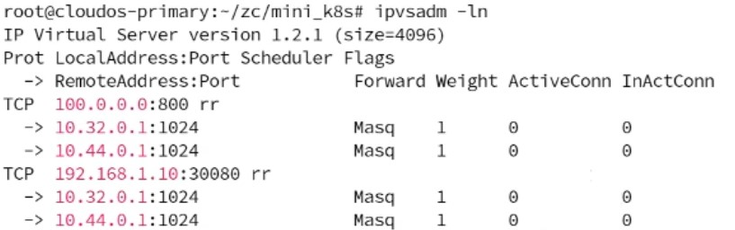

Similar to Kubelet, Kubeproxy periodically polls the control plane for all Services and Pods in the cluster. Based on the label selector and the exposed ports of the Pod's containers, it calculates all Endpoints for each Service and compares this with the latest local cache. When it discovers that the local version is outdated and local IPVS rules need updating, it calls the encapsulated IPVS interfaces to perform the update.

### 5.4 ReplicaSet Abstraction

A ReplicaSet is a replica controller whose primary function is to manage the Pods under its control, ensuring that the number of available Pod replicas always matches the preset count. A ReplicaSet determines which Pods it manages via label selectors.

A ReplicaSet configuration file includes the ReplicaSet name, the number of replicas, the label selector, and the Pod template used to add Pods when the count is insufficient. An example is as follows:

```yaml
kind: ReplicaSet
apiVersion: v1
metadata:
  name: nginx-replicaset
  namespace: default
spec:
  replicas: 2
  selector:
    matchLabels:
      app: nginx
  template:
    metadata:
      name: nginx-pod
      namespace: default
      labels:
        app: nginx
    spec:
      containers:
        - name: container
          image: python:latest
          ports:
            - containerPort: 1024
              protocol: tcp
```

When a request to create a ReplicaSet reaches the apiserver, the apiserver stores the ReplicaSet data in etcd. The ReplicaSetController then polls all ReplicaSets and Pods in the cluster to calculate the number of available Pods based on the label selector. If the number of Pods exceeds the replica count, it sends a request to the apiserver to delete the corresponding Pods; if the number is insufficient, it sends a request to the apiserver to add Pods matching the template in the ReplicaSet.

When computing the current Pod count, Pods in a `Failed` state are ignored. Thus, when a Pod exits abnormally, the ReplicaSet will respond by adding a new Pod.

### 5.5 Dynamic Scaling (HPA)

Scaling here refers to HorizontalPodAutoscaling, which entails changing the number of Pods of a certain type to respond to changes in resource metrics.

HPA is implemented on top of ReplicaSets. When the HPAController determines that the number of Pods needs to change based on Pod metrics, it will alter the replica count in the corresponding ReplicaSet Spec via an interface.

Below is a brief introduction to the fields of the HPA API object.

```yaml
kind: HorizontalPodAutoscaler
apiVersion: v1
metadata:
  name: test-hpa
spec:
  scaleTargetRef:
    kind: ReplicaSet
    name: nginx-replicaset
    namespace: default
  minReplicas: 1
  maxReplicas: 3
  scaleWindowSeconds: 20
  metrics:
    - name: cpu
      target:
        type: Utilization
        averageUtilization: 50
        upperThreshold: 80
        lowerThreshold: 20
    - name: memory
      target:
        type: AverageValue
        AverageValue: 100
  behavior:
    scaleUp:
      type: Pods
      value: 1
      periodSeconds: 60
    scaleDown:
      type: Pods
      value: 1
      periodSeconds: 60
```

- `spec.scaleTargetRef`: The ReplicaSet bound to the HPA.
  - `name`, `namespace`: Uniquely identify the ReplicaSet.
- `minReplicas`, `maxReplicas`: The upper and lower bounds for HPA scaling.
- `scaleWindowSeconds`: At most one scaling event can occur within a single window period.
- `metrics` supports statistics for CPU and memory.
  - `target` supports two types:
  - `Utilization`: Usage rate, with corresponding boundaries `upperThreshold`/`lowerThreshold`.
  - `AverageValue`: Usage amount; the corresponding unit for memory here is MB.
- `behavior` supports `scaleUp` and `scaleDown`.
  - `value`: The maximum number of Pods to change during a single scaling event.
  - `periodSeconds`: Only historical data within this timeframe is considered; data outside this range is disregarded.

Implementing HPA involves three main parts: cAdvisor collection integrated into the kubelet, uploading and saving data to the control plane, and the HPAController fetching historical data from the control plane.

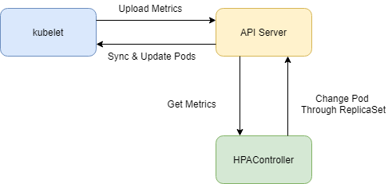

cAdvisor collection integrated into kubelet requires launching a cAdvisor container, periodically checking cAdvisor availability, and uploading data.

The control plane implements a simple custom TSDB (Time Series Database), where data exceeding its validity period is invalidated.

The HPAController periodically fetches the required metric source data from the control plane and decides whether to scale based on specific strategies.

The specific workflow of HPAController is:

1. Periodically filter the Pods that need monitoring based on the ReplicaSet contained in the HPA.
2. Obtain historical Pod data from the control plane using `periodSeconds` before the current time as the boundary.
3. Calculate the average usage.
4. Judge whether scaling is necessary based on the thresholds.
5. If scaling is required, check if it is within the same time window as the last successful scale; if it is, perform no operation.
6. By default, choose the strategy among various options that results in the largest final change.

After the expected count of the ReplicaSet is altered, the ReplicaSet manages the addition or deletion of Pods on its own.

### 5.6 DNS and Forwarding

In this project, the DNS API object serves two major functions: one is to support resolving custom domain names to specific Services, and the second is to support mapping different paths under the same domain to different Services based on the former.

The DNS configuration file includes: DNS name, DNS rules (including the domain name and the backend services corresponding to sub-paths). An example is as follows:

```yaml
apiVersion: v1
kind: DNS
metadata:
  name: my-dns
spec:
  rules:
    - host: myservice.com
      paths:
        - path: /nginx
          backend:
            service:
              name: nginx-service
              port: 800
        - path: /python
          backend:
            service:
              name: python-service
              port: 900
```

To support custom DNS resolution, coredns must be started on the host machine of the worker node, and it must be specified as the DNS server for both the Pod and the host (achieved by modifying the `/etc/resolv.conf` file of both). Additionally, the nginx service must be started. Kubeproxy will find the latest configuration by polling the apiserver, and dynamically modify the configuration files for both based on this to make the DNS available. As shown in the diagram below, a custom domain configured via a DNS API object is resolved to the IP address that nginx is listening to, and nginx further distributes the traffic to different backend services based on path matching.

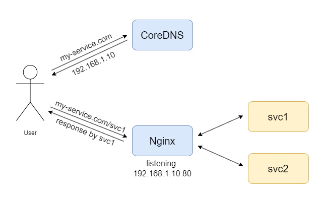

The configuration method for coredns is as follows; when adding a domain, simply write a new entry into `/etc/coredns/hosts`:

```
. {
    hosts /etc/coredns/hosts {
        fallthrough
    } 
    forward . 202.120.2.100 202.120.2.101 
    log
    errors
}
```

The configuration method for nginx is as follows; when adding a domain, create a new configuration file in `/etc/nginx/conf.d`:

```
server {
    listen 80; 
    server_name my-service.com;
    location /svc1 {
        proxy_pass http://100.0.0.0:8080/;
    }
    location /svc2 {
        ...
    }
}
```

When implementing microservices, since the common practice is to use the service name as the domain name, a DNS resolution configuration mapping `ServiceName` to `ServiceIP` is additionally added when creating a Service. Thus, applications can access a specific Service via `ServiceName:Port/path` in addition to using `ServiceIP`.

### 5.7 Fault Tolerance

In this project, restarting the control plane is required to have no impact on the Pods and Services in the cluster. To this end, the following approaches were adopted in the implementations of the control plane and worker nodes, respectively:

- All control plane components are implemented as stateless.
  - The apiserver itself does not store any session information and provides stateless RESTful APIs.
  - During the process of polling the apiserver, other control plane components have no state that needs to be stored in memory other than intermediate calculation results. A restart results, at most, in the loss of one intermediate calculation result.
  - The configuration and state data of all API objects are entirely persisted in etcd.
- When worker nodes lose connection to the control plane, they always attempt to maintain the node status at the last known desired state, rather than reclaiming resources on the local node.

### 5.8 Multi-Node

This project supports running multiple worker nodes simultaneously. When Kubelet starts, you can specify the IP of the control plane node via the `-j` parameter and specify the local Node configuration file via the `-c` parameter (optional). During startup, it registers itself with the apiserver, and thereafter, the scheduler will begin scheduling Pods to this new node. When Kubelet exits, it will also deregister its node, and the Pods originally scheduled to that node will return to an Unscheduled state, ready to be scheduled again.

Since the NodeAffinity strategy of the Scheduler only needs to consider the `label` of the Node, and other strategies are independent of node configurations, the Node configuration file is relatively simple, containing only three fields: `kind, apiVersion, metadata`.

Because the weave CNI plugin already supports multi-node clusters, Service implementation requires no adjustment in a multi-node scenario; you can access any Pod under the same Service from different nodes without concerning yourself with where it runs.

### 5.9 MicroService

#### 5.9.1 Traffic Hijacking and Forwarding

To enable Envoy to hijack traffic within the Pod, iptables rules need to be configured inside the Pod's network namespace. Referencing istio's implementation, four chains (prefixed with `MISTIO`) and some routing rules are added to the nat table, as shown in the diagram below:

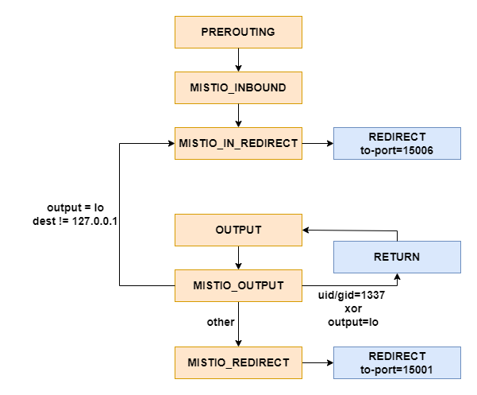

After configuration, all inbound traffic is redirected to port 15006, and outbound traffic is redirected to port 15001, both of which are listened to by Envoy. There are a few special cases:

- To avoid infinite loops—meaning Envoy hijacking its own outbound traffic—the Envoy process is assigned a unique UID (1337). It is specified in iptables that no action is taken for outbound traffic with UID or GID=1337.
- When traffic exits from the lo (loopback) network interface: if the address is not a loopback address, it indicates an inter-pod access using a non-loopback address (e.g., destination is a local PodIP assigned by CNI), and this traffic should be treated as inbound traffic and hijacked. If the address is a loopback address, it indicates the application explicitly intends to access a local port, and no processing is applied to this traffic.

Since iptables rules must be configured by the root user, this process must be completed within a privileged initContainer (i.e., specifying `privileged = true` in the configuration file).

The traffic type currently supported is HTTP traffic. When Envoy's corresponding ports capture inbound/outbound HTTP requests, it reads the Host and URL from the HTTP message. Based on the `SidecarMapping` obtained from pilot, it uses a weighted random or URL regex matching algorithm to determine the actual destination of the traffic, and starts an HTTP reverse proxy (Golang's built-in `httputil.ReverseProxy`) to serve the request.

To inject Envoy into a Pod, modifications indicated by the red boxes in the figure are required. Both the envoy and envoy-init images are custom-built, and their Dockerfiles are located in the `cmd/envoy` and `cmd/envoyinit` directories:

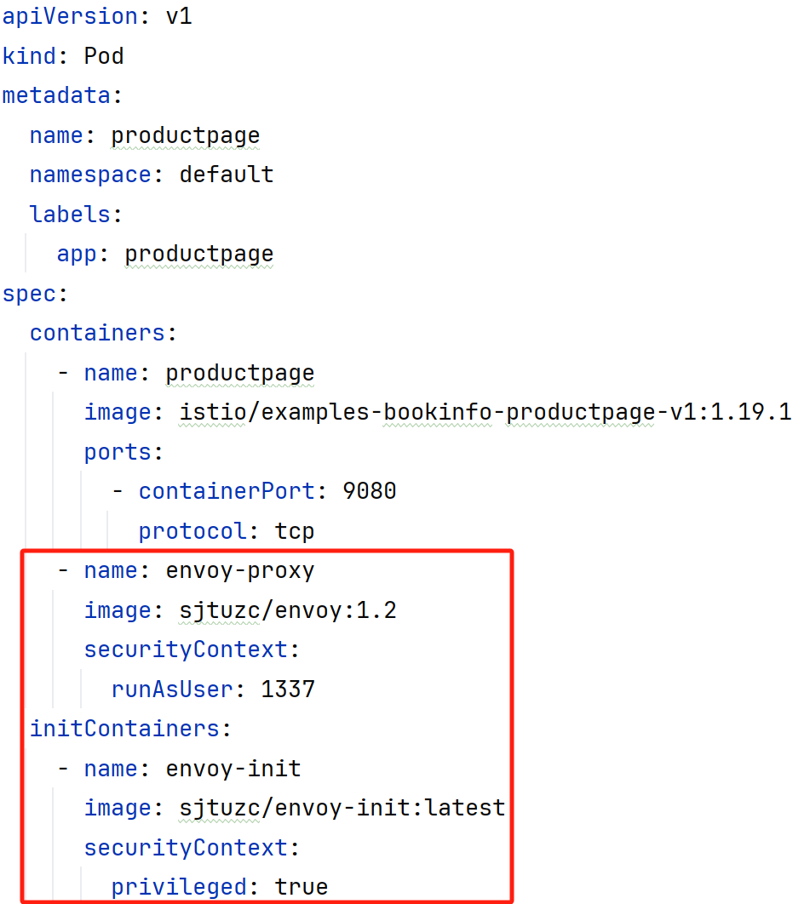

#### 5.9.2 Traffic Forwarding Control

This project controls traffic forwarding via two API objects: VirtualService and Subset.

The configuration file for VirtualService mainly includes: VirtualService name, the Service name and port it manages, and the Subsets it contains along with their weights or URLs. Weights and URLs can only be specified one at a time. An example is as follows:

```yaml
apiVersion: v1
kind: VirtualService
metadata:
  name: nginx-vs
  namespace: default
spec:
  serviceRef: nginx-service
  port: 802
  subsets:
    - name: nginx-v1
      weight: 1
    - name: nginx-v2
      weight: 2
```

The Subset configuration file mainly includes: Subset name and the Pods it manages. An example is as follows:

```yaml
apiVersion: v1
kind: Subset
metadata:
  name: nginx-v1
  namespace: default
spec:
  pods:
    - nginx-pod-1
    - nginx-pod-2
```

Pilot continuously monitors the VirtualServices, Subsets, and Services stored in etcd. Based on the configuration, it calculates how the traffic of the Services managed by a VirtualService is forwarded to each Endpoint according to weighting or URL matching. If traffic distribution by weight is specified, the weight of each Subset is ultimately computed into the weight of each Endpoint (for instance, if the Subset weights are `[1, 2]` and the Subset sizes are `[2, 1]`, the final weight ratio will be `[1, 1, 4]`). Additionally, it computes the forwarding methods for other Services not managed by a VirtualService, in which case all Endpoints are given a default equal weight. The aforementioned calculation result is termed `SidecarMapping`, representing the mapping `(ServiceIP, Port)->[(PodIP, TargetPort, Weight/URL)]`. It is stored in etcd for retrieval by each Envoy.

#### 5.9.3 Canary Release

With the previously mentioned VirtualService + Subset API objects, users can implement canary releases for their services by themselves:

- First, define Subsets for the new and old versions of the service, such as subset-v1 and subset-v2.
- During different stages of the canary release, create different VirtualServices and adjust the weight (or URL) of each Subset as needed to achieve the goal of a canary release.

#### 5.9.4 Rolling Update

The configuration file contents for a Rolling Update include: name, managed Service port, minimum alive Pods, update interval time, and the target Pod Spec. An example file is as follows:

```yaml
apiVersion: v1
kind: RollingUpdate
metadata:
  name: my-ru
spec:
  serviceRef: reviews
  port: 9080
  minimumAlive: 1
  interval: 15
  newPodSpec:
    containers:
      - name: reviews
        image: istio/examples-bookinfo-reviews-v3:1.19.1
        ports:
          - containerPort: 9080
            protocol: tcp
      - name: envoy-proxy
        image: sjtuzc/envoy:1.2
        securityContext:
          runAsUser: 1337
    initContainers:
      - name: proxy-init
        image: sjtuzc/envoy-init:latest
        securityContext:
          privileged: true
```

When executing a rolling update, `total - minimumAlive` Pods are deleted each time and re-added based on the new Pod Spec. At the same time, using the aforementioned traffic control method, a Subset is created and its weight set to 0, preventing traffic from reaching the Pods currently being updated. Both after deletion and creation, it will wait for `0.5 * interval` seconds to ensure the service has enough time to start.

## 6. Individual Assignments

### 6.1 Persistent Storage

The persistent storage feature is located in the `feature/pv` branch.

Persistent storage in this project is implemented based on two abstractions: PersistentVolume (PV) and PersistentVolumeClaim (PVC). PV represents real storage resources, while PVC represents a claim for real resources. After a PVC is created, it will bind with an available PV in the cluster that meets the requirements. A Pod can mount its bound PV by specifying the PVC name.

The PV configuration file includes: PV name, capacity, and storage class name (in this project, the storage class concept in k8s is simplified, currently supporting only one storage class, `nfs`, whose provisioning method is integrated into the code logic). An example is as follows:

```yaml
apiVersion: v1
kind: PersistentVolume
metadata:
  name: test-pv
  namespace: default
spec:
  capacity: 1Gi
  storageClassName: nfs
```

The PVC configuration file includes: PVC name, requested capacity, and storage class name. An example is as follows:

```yaml
apiVersion: v1
kind: PersistentVolumeClaim
metadata:
  name: test-pvc-1
  namespace: default
spec:
  request: 500Mi
  storageClassName: nfs
```

There are two ways to bind a PVC to a PV: one is to bind with an already created PV in the cluster that meets the requirements based on the storage class name and requested capacity; the second is to dynamically create a PV based on the storage class name when no existing PV in the cluster meets the requirements. Currently, this project supports the `nfs` storage class by default.

The management of PVs and PVCs is handled by the PVController. The PVController will poll the PVs and PVCs in the cluster to perform the following operations:

- For created PVs in a `Pending` state, it creates directories for them on the local node, and exports them by modifying the `/etc/exports` file and running `exportfs -ra`. They can then be mounted by any node in the intranet via an NFS client. At this point, the PV state transitions to `Available`.
- For created PVCs in a `Pending` state, it searches for all PVs in the `Available` state to bind them. At this time, the status of both becomes `Bound`, and the bidirectional binding relationship is stored in their `Status` fields. If no qualifying PV is found, it attempts to create one and waits to bind during the next polling cycle.
- For deleted PVCs, it changes their PV status back to `Available`.

To create a Pod that mounts a persistent volume, the configuration file is as follows:

```yaml
apiVersion: v1
kind: Pod
metadata:
  name: pvc-pod
  namespace: default
spec:
  containers:
    - name: c1
      image: alpine:latest
      volumeMounts:
      - name: pv
        mountPath: /mnt/pv
  volumes:
    - name: pv
      persistentVolumeClaim:
        claimName: test-pvc-1
```

When the Pod is created, the specified PVC must already be in the `Bound` state. Kubelet will create a temporary host directory associated with this volume and use `mount -t nfs` to mount the path exported by the NFS server onto the host machine. Subsequently, it mounts this host directory into the Pod via the Docker SDK. When the Pod is deleted, after using `umount` to unmount it, the local directory is then cleared to prevent the actual resources of the PV from being deleted. The mounting relationship is shown in the diagram:

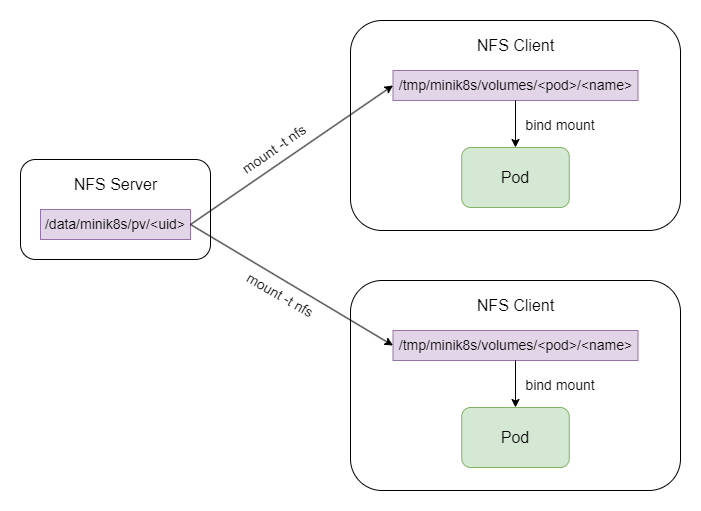

Thus, cluster-level persistent storage can be realized. Even after a Pod is deleted or exits, because the NFS server directory remains persistently saved, the PV can be re-bound to other Pods without losing the data stored in the PV.

### 6.2 GPU

The implementation of GPU tasks refers to the Job class in k8s. The Job configuration file contents include: Job name, specific GPU configuration requirements, and CUDA program location. An example file is as follows:

```yaml
kind: Job
metadata:
  name: gpujob
spec:
  partition: dgx2
  threadNum: 1
  taskPerNode: 1
  cpu_per_task: 6
  gpu-num: 1
  file: result
  codePath: /root/tz/localdesk/mini_k8s/scripts/data/add.cu
```

Once the request to create a Job reaches the apiserver, the apiserver will store the Job data in etcd. The JobController monitors the number of Jobs in the environment, generates corresponding scripts based on unassigned Jobs, performs file transfers, and creates the corresponding Pods. It sends a Pod creation request to the apiserver, and the created Pod executes the sbatch command. It then returns the results of the GPU computation task, which are stored by the apiserver in etcd as a JobStatus.

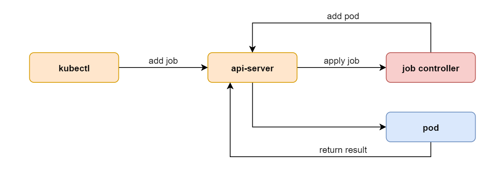

To view the execution results of a GPU job, use the command:

```
$ ./bin/kubectl get job jobname
```

### 6.3 Cluster Monitoring

The cluster monitoring feature is located in the `feature/prometheus` branch.

This functionality is implemented based on Prometheus dynamically reading configuration files.

```yaml
# my global config
global:
  scrape_interval: 10s # Set the scrape interval to every 10 seconds.
  evaluation_interval: 10s # Evaluate rules every 10 seconds. 

# A scrape configuration containing exactly one endpoint to scrape:
scrape_configs:
  # The job name is added as a label `job=<job_name>` to any timeseries scraped from this config.
  - job_name: "cadvisor"
    file_sd_configs:
      - files:
        - ../../mini_k8s/cmd/stats-controller/test/nodes/*.yml
        refresh_interval: 10s
    
  - job_name: "diy"
    file_sd_configs:
      - files:
        - ../../mini_k8s/cmd/stats-controller/test/pods/*.yml
        refresh_interval: 10s
```

By specifying two jobs, it will fetch all yml files from the specified paths. The yml files contain the `/metrics` paths that Prometheus can scrape. The format is:

```yaml
- targets: 
  - 192.168.1.10:8090
```

The StatsController will periodically poll the apiserver to fetch the required Node and Pod information, and generate relevant configuration files at the specified paths.

**Monitoring of all Nodes**:

It only needs to periodically retrieve the information of all nodes from the apiserver. Since each node has cAdvisor installed and exposes port 8090, the configuration information and loads of each node can be obtained through the cAdvisor interfaces.

For Grafana, the original K8s design can be referenced, ensuring that the Node can be uniquely identified by certain fields. The implementation here utilizes the Node Internal IP.

**Monitoring of Custom Metrics for Pods:**

Using a Python program, it requires importing `prometheus_client` to specify custom metrics and expose corresponding metrics ports.

The Python script is packaged into a Python image, with startup parameters and exposed ports set. The pod can be started by specifying the image.

```yaml
kind: Pod
apiVersion: v1
metadata:
  name: prome-pod
  namespace: default
  labels:
    app: prome
    monitor: prometheus
    monitorPort: "32001"
spec:
  containers:
    - name: container
      image: lzl-prome:latest
      ports:
        - containerPort: 32001
          protocol: tcp
```

The fields related to monitoring are `monitor` and `monitorPort` under `labels`. Only when `monitor` is present and `monitor = "prometheus"` will the corresponding `monitorPort` be monitored.