# MiniK8s 验收报告

## 1. 项目总览

项目仓库地址：https://github.com/GMH233/mini_k8s

### 1.1 项目总体架构

MiniK8s项目的实现架构参考了kubernetes的架构，集群中存在唯一的master节点和若干worker节点。apiserver为用户以及其他所有集群组件提供api，集群的配置/状态存放在etcd中，其他集群组件通过apiserver获取所需信息。

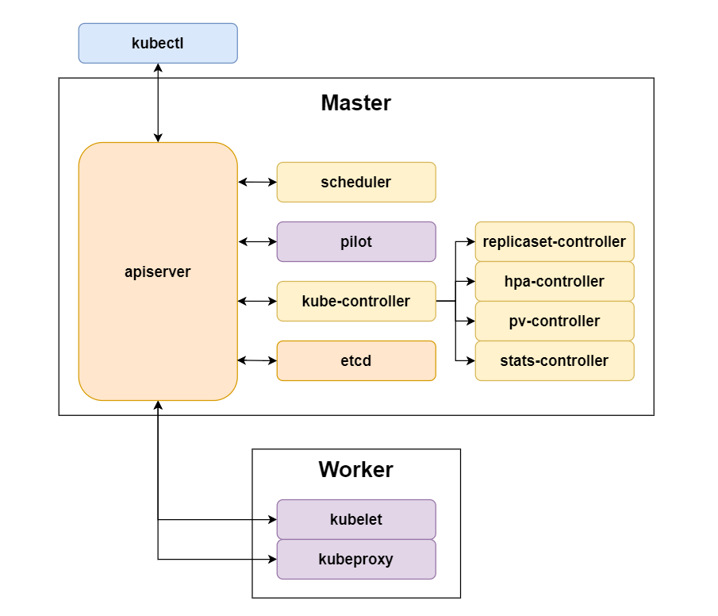

### 1.2 项目关键组件简要描述

- kubelet： 监听api-server以在节点上根据要求创建pod，并管理pod生命周期

- kube-proxy： 配置DNS和Service
- envoy：服务网格的sidecar proxy，劫持流量并基于路由配置进行路由

- pilot：服务网格的控制面组件，实时计算路由配置

- scheduler：负责把pod调度到集群中的不同工作节点上
- apiserver:  负责各组件之间的信息交互，提供统一的api，实现etcd持久化
- controller-manager： 负责管理集群内各类资源，如replicaset，hpa等

### 1.3 软件栈及开源库

#### 1.3.1 软件栈

本项目主体使用Golang开发，go语言版本为1.22，Kubernetes参考源码的版本为1.30

Docker对于go语言的支持比较友好，提供了很多api，方便我们获取容器的底层状态。

MiniK8s的api接口基于Kubernetes 1.30，根据实际要求进行了修改。

具体软件栈如下：

| 功能           | 使用组件 |
| -------------- | -------- |
| 持久化存储     | etcd     |
| 容器运行时接口 | docker   |
| CNI插件        | weave    |
| dns服务器      | coredns  |
| 反向代理       | nginx    |
| 容器性能监控   | cadvisor |

#### 1.3.2 主要开源库

| 功能                     | 地址                                                         |
| ------------------------ | ------------------------------------------------------------ |
| APIServer框架            | [github.com/gin-gonic/gin](https://github.com/gin-gonic/gin) |
| 与docker交互的docker sdk | [github.com/docker/docker](http://www.github.com/docker/docker) |
| iptables规则管理         | [github.com/](http://www.github.com/coreos/go-iptables)[coreos](http://www.github.com/coreos/go-iptables)[/go-iptables](http://www.github.com/coreos/go-iptables) |
| ipvs规则管理             | [github.com/](http://www.github.com/moby/ipvs)[moby](http://www.github.com/moby/ipvs)[/](http://www.github.com/moby/ipvs)[ipvs](http://www.github.com/moby/ipvs)[ ](http://www.github.com/moby/ipvs) |
| 解析终端输入的命令行工具 | [github.com/spf13/cobra](http://www.github.com/spf13/cobra)  |
| go的yaml文件解析         | [gopkg.in/yaml.v3](https://gopkg.in/yaml.v3)                 |
| uuid生成                 | [github.com/google/uuid](github.com/google/uuid)             |
| cAdvisor客户端           | [github.com/google/cadvisor/client/v2](github.com/google/cadvisor/client/v2) |
| cAdvisor信息格式         | [github.com/google/cadvisor/info/v2](github.com/google/cadvisor/info/v2) |
| etcd客户端               | [go.etcd.io/etcd/client/v3](go.etcd.io/etcd/client/v3)       |
| kubeproxy网链            | [github.com/vishvananda/netlink](github.com/vishvananda/netlink) |

## 2. 项目贡献和分工

小组成员如下：

| 姓名   | 学号         | 成员 | 贡献度 |
| ------ | ------------ | ---- | ------ |
| 李哲璘 | 521021910874 | 组长 | 32%    |
| 章程   | 521021910774 | 组员 | 36%    |
| 唐正   | 521021910768 | 组员 | 32%    |

详细分工：

**李哲璘**：

apiserver框架、apiserver接口管理维护、etcd持久化集成、kubeclient、kubectl主体、controllerManager、部分replicaset、HPA、微服务pilot设计、集群监控、脚本编写、答辩视频录制、答辩视频剪辑、答辩演示、文档编写

**章程**：

kubelet主体、CNI网络插件、service实现、DNS抽象、微服务流量转发、灰度发布、滚动升级、微服务部署、部分scheduler、kubectl架构、CI/CD设计、kubelet多机支持、持久化存储、脚本编写、答辩视频录制、答辩视频剪辑、答辩演示、文档编写

**唐正**：

部分Pod抽象、部分kubelet、replicaset主体、scheduler、微服务pilot实现、GPU部分、文档编写

## 3. 项目管理和开发

### 3.1 分支管理

主要分为三种分支：

- main分支：成品所在的分支
- dev分支：新功能通过本地测试后，通过PR合并到dev分支，进行CI/CD测试，进行功能合并
- feature/* 分支：分别开发的功能点分支，相对独立

### 3.2 测试及CI/CD

#### 3.2.1 测试

由于`*_test.go`文件和源码文件处于一个文件夹下，会导致项目文件比较混乱，我们在`./test`文件夹下对主要的组件进行测试。

我们采用开发和测试分离的方式，在本地机器上利用ide的功能进行开发，然后将源码同步到服务器上实际运行和测试。

#### 3.2.2 CI/CD

在服务器上本地测试通过后，我们会将测试通过的分支上传到GitHub。利用GitHub的Workflow，当push到dev分支或者PR到dev分支的时候，会触发CI/CD过程，通过自定义的测试脚本，每次运行前的环境会全部初始化。

对dev分支的更改，只有通过CI/CD测试的才被认为有效。

### 3.3 新功能开发工作流

#### 3.3.1 开发模式

项目的推进采用**API驱动**和**快速迭代开发**相结合的方式。

对于新的功能，我们在进行需求分析之后，进行api对象的设计，然后设计对应的接口，针对接口进行运行逻辑的代码编写。

接口统一使用postman管理，小组成员之间共享接口。

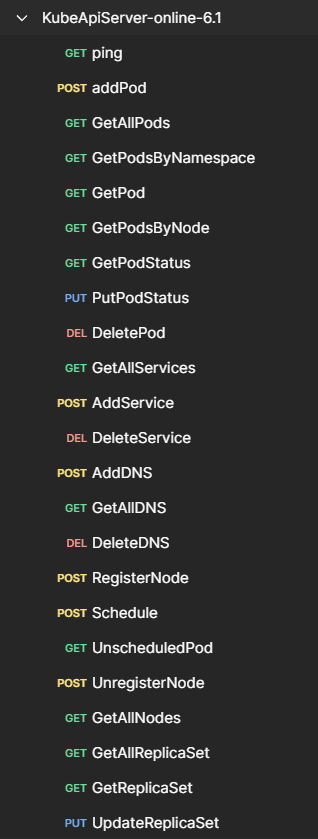

在所有接口都测试通过之后，我们会编写对应的kubectl逻辑。

迭代方面，我们按照项目迭代计划进行开发，每周末如果有本次迭代相关的问题，当面集中解决，减少返工。

#### 3.3.2 开发节奏

我们的开发基本遵循迭代计划，2周一次迭代。

在每周的周一，周五，周六会集中进行开发，有困难可以现场沟通。

截至第16周答辩前，我们已经完成了全部要求内容，基本符合计划预期。

## 4. 系统架构和组件功能

### 4.1 Kubelet

Kubelet运行在每一个工作节点上，主要负责在本节点上Pod的创建和删除，Pod生命周期的监控与管理，Pod状态的回传同步。具体来说，Kubelet几大功能点的实现方式如下：

1. Pod的创建和删除：Kubelet周期性地向控制面询问本节点上的所有Pod配置，通过与本地的最新缓存进行对比，计算出一次询问周期内的所有配置变更（即Pod的增加/删除），并调用容器运行时接口进行相应操作。
2. Pod生命周期的监控与管理：Kubelet进程包含一个PLEG（Pod Lifecycle Event Generator）子协程，通过周期性地询问容器运行时接口，获取所有Pod的运行期状态，与最新的缓存进行对比。若新旧状态不一致，则生成相应的生命周期事件通知主协程，由主协程根据事件类型决定如何应对该事件（例如制定了重启策略时，当收到`ContainerDied`事件时，将会执行容器重启操作）。
3. Pod状态的回传同步：当收到生命周期事件时，Kubelet将本地缓存中最新的Pod状态发送给apiserver；此外，Kubelet还会通过定时器，定期将收集到的容器指标（cpu，内存使用情况等）回传给apiserver。

为了支持以上功能的实现，Kubelet总体架构如图所示：

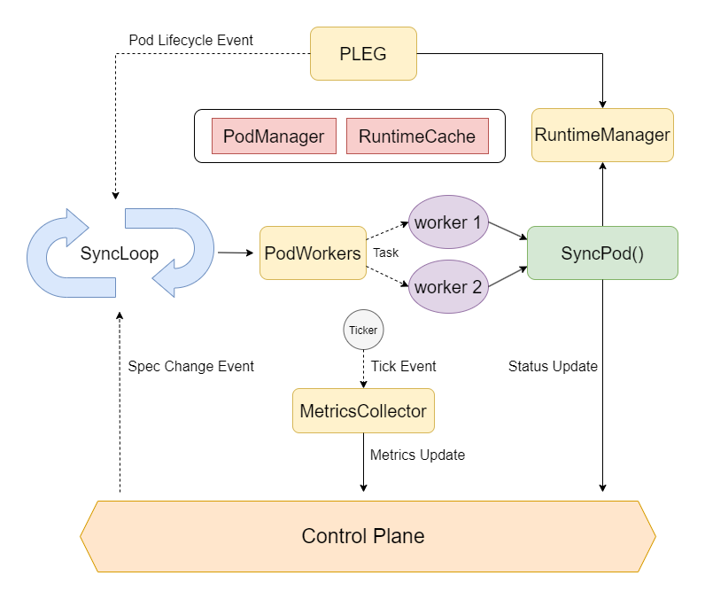

图中实线箭头为函数调用，虚线箭头为事件传播。有关子组件功能如下：

* `pod.Manager`: 提供Pod Specification的本地缓存接口。
* `runtime.Cache`: 提供Pod Status的本地缓存接口。
* `runtime.RuntimeManager`: 对docker sdk的封装层，将容器粒度的操作封装为Pod粒度的操作，提供`AddPod`，`DeletePod`，`GetPodStatus`等接口。
* `pleg.PLEG`: 定期计算Pod生命周期事件发送给主协程。
* `metrics.MetricsCollector`: 不断通过cadvisor获取容器指标，发送给控制面。
* `kubelet.PodWorkers`: 为每一个Pod分配一个worker协程，并提供把任务下放到worker协程的接口供主协程使用（异步任务，缩短主协程的阻塞时间，减少latency）。

可以看出，Kubelet主协程实质上是一个事件循环，侦听配置变更，生命周期，定时任务等事件并进行相应操作。go语言的 goroutine + channel 特性为实现事件循环提供了很大的便利。

### 4.2 Kubeproxy

Kubeproxy同样运行在每个工作节点上，主要负责：

1. 根据集群中的Service配置，在本节点上进行流量的转发，使用户能够通过Service的虚拟IP（Cluster IP）或节点端口（NodePort）访问到Service的真实提供者（Endpoint）。
2. 根据集群DNS配置，在本节点上配置DNS nameserver，提供给Pod和宿主机使用。由于url路径是http层的概念，要支持不同路径指向不同service，还会配置http反向代理。

本项目中，Kubeproxy利用Linux IPVS进行流量转发，使用coredns作为DNS服务器，nginx作为反向代理。Service和DNS的实现细节见第5节。

### 4.3 Envoy/Pilot

Envoy是基于sidecar架构实现的服务网格中，被注入到每个Pod中的sidecar proxy，而Pilot则是服务网格的控制面组件。用户可以声明式指定微服务之间的流量转发方式，由Pilot基于此计算生成一个路由表（称为`SidecarMapping`），包含了 `(ServiceIP, Port)` 到 `[(EnpointIP, TargetPort, weight/URL)]` 的映射。Envoy则劫持Pod的所有进出站流量，并通过该路由表进行转发。

本项目中的服务网格架构如下：

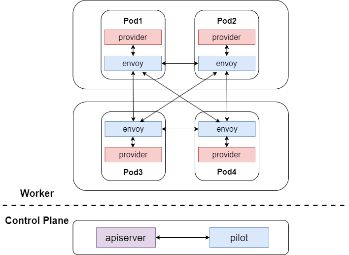

### 4.4 Scheduler

Scheduler 是一个控制面组件，负责将未调度的Pod调度到合适的节点上。目前 Scheduler 支持三种策略：

1. Round Robin：将Pod轮流调度到不同节点上。
2. Random：随机选择一个节点调度。
3. Node Affinity：根据 Pod 和 Node 配置文件中的 `label` 字段进行匹配，优先将 Pod 调度到匹配的 Node 上。否则随机匹配。

在本项目中，Pod 与其所属的 Node 的映射关系单独存储在 etcd 中，方便快速查询指定 Node 的所有 Pod。

### 4.5 API Server

API Server是所有api交互的中心，也是控制节点的核心。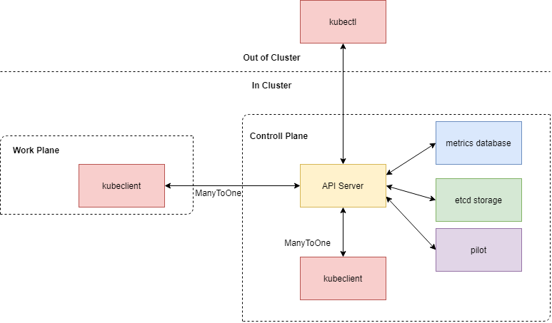

API Server主要负责：

1. 暴露API接口供其他组件使用
2. 同etcd交互以实现持久化
3. 接受来自kubelet的pod监控数据

API Server使用Gin框架实现，实现了一系列的Restful API接口，将每个`url+方法`的请求绑定到handler函数上。

handler函数成组出现，主要对以下各种API对象做处理：

- Node的查询，注册和解除注册
- Pod的增删改查，Pod状态的查询和修改，Pod的调度
- Service的增删改查
- DNS的增删改查
- ReplicaSet的增删改查
- Pod统计数据的增删查
- HPA的增删改查
- VirtualService的增删改查
- Subset的增删改查
- SidecarMapping的增删改查
- RollingUpdate的增删改查

对于集群内的Request Message，我们进行了泛型设计，可以返回不同类型的数据；如果过程中出错，可以在message中夹带具体错误信息。

### 4.6 Controller Manager

Controller对更高级的抽象进行管理，而ControllerManager将各个Controller统一管理。

ControllerManager在启动的时候，会将各个Controller作为子协程启动。

- **ReplicaSetController**：轮询集群中所有ReplicaSet和Pod，根据标签选择器计算可用Pod数量。
- **HPAController**：对其关联ReplicaSet管理的Pod指标，基于策略计算是否扩缩容
- **PVController**：轮询集群中的PV和PVC，实现集群级的持久化存储
- **StatsController**：基于各个node的信息和具有自定义指标的Pod的信息，动态生成Prometheus可读的配置文件。

### 4.7 Kubectl

Kubectl作为MiniK8s的命令行工具，和控制面交互以完成对API对象的查找，部署，删除等功能。

Kubectl使用了Cobra进行命令行操作的美化，提高了命令行解析效率。


kubectl支持的命令如下：

**查询**

- `kubectl get [APIObject]    ` ：获取某种类型的全部对象信息
  - 这里APIObject为了方便起见，单复数形式都可以被接受

**部署**

- `kubectl apply -f /path/to/yaml ` ：根据yaml中的对象解析出相应的类型并部署
  - 如果解析有错误，会提示marshal错误
  - 如果部署有错误，会显示从apiserver返回的具体错误信息

**删除**

- `kubectl delete -f /path/to/yaml` ：根据yaml文件中的类型，name和namespace进行删除
  - 不严格检查yaml格式
- `kubectl delete [APIObject] [name]`：在namespace = default中删除该名称对应的对象
- `kubectl delete [APIObject] -p [namespace] -n [name]`：指定namespace和name，删除该对象

**描述**

- `kubectl describe [APIObject] [name]`：在namespace = default 中描述该名称对应的对象
- `kubectl describe [APIObject] -p [namespace] -n [name]`：指定namespace和name，描述该对象
  - 更为详细的信息
  - 可以方便增加输出对象原始json的功能

### 4.8 Kubeclient

Kubeclient作为和API Server交互的功能组件，不暴露给外界，仅仅是集群内的各个组件使用。

需要和API Server交互的组件，都会绑定一个Kubeclient. 因此，Kubeclient具有完备的接口。

## 5. 功能实现细节

### 5.1 Pod抽象

Pod是一组共同工作的容器的抽象，属于同一个Pod的容器共享同一个网络命名空间，可以通过localhost互相访问，且可以通过指定存储卷的创建与挂载实现文件共享。同时，Pod也是MiniK8s中其他高级功能管理的最小单元（如Service / MicroService，ReplicaSet / HPA，Scheduler等等）。

Pod的配置文件内容包括：Pod名称，容器（包括镜像，命令，暴露端口，卷挂载点，资源用量，安全上下文），存储卷（包括卷名称，卷类型），初始化容器（运行后即退出），重启策略（目前支持None和Always）。示例如下：

```yaml
apiVersion: v1
kind: Pod
metadata:
  name: test-pod
  namespace: default
spec:
  containers:
    - name: python
      image: python:latest
      command: ["python", "-m", "http.server", "8000"]
      ports:
        - containerPort: 8000
          protocol: tcp
      volumeMounts:
        - name: volume1
          mountPath: /mnt/v1
      resources:
        limits:
          cpu: 500m
        requests:
          cpu: 100m
      securityContext:
        privileged: true
  initContainers:
    - name: init
      image: python:latest
  volumes:
    - name: volume1
      emptyDir: {}
  restartPolicy: Always
```

下面通过一个Pod的生命周期，详细说明Pod抽象的实现方式：

1. Pod从创建到在集群内可见

	* 当用户使用 `kubectl apply` 创建Pod时，apiserver校验参数后将其存入etcd，此时Pod状态字段为空，且处于未调度状态。Scheduler在轮询中会获取到这个未被调度的Pod，通过一定调度策略向apiserver发起调度请求，此时etcd中会新增一项Node到Pod的映射。Kubelet通过 `GetPodByNode` 接口便可获取到该Pod，更新Pod Spec缓存，并创建一个worker协程，并在worker协程中调用 `RuntimeManager` 的 `AddPod` 接口。

	* 在 `AddPod` 中，为了使容器共享网络命名空间，首先会创建一个Pause容器，并将其他容器的网络模式设为 `container` 模式。这样，所有容器都与Pause容器共享网络命名空间。至于创建容器的其他操作，则均能通过调用docker sdk直接实现（暴露端口，挂载卷等等）。

	* PLEG在Relist定时循环中，通过`RuntimeManager`的 `GetPodStatus` 接口获取到所有Pod的容器的运行状态。由于有新Pod启动，会发现两次Relist之间获取到的状态不同，于是将最新状态更新到Pod Status缓存，并根据新旧状态计算出生命周期事件 `ContainerStarted`，发送给主协程。主协程将缓存中的状态回传给apiserver，此时Pod状态在整个集群内可见。
2. Pod被集群删除
	* 用户可以使用 `kubectl delete` 删除Pod，此时apiserver会直接删除etcd中有关该Pod的所有数据。Kubelet随后会发现本节点的Pod发生了变化，触发一次删除操作，删除Pod Spec缓存，使用 `RuntimeManager` 的 `DeletePod` 接口清除属于该Pod的所有容器（包括Pause）。
	* PLEG发现容器被移除，发送 `ContainerRemoved` 事件，但由于本地Pod Spec缓存中已不再有该Pod的条目，事件被日志记录后忽略。

3. Pod内容器退出
	* PLEG发现容器退出，发送 `ContainerDied` 事件。若Pod的重启策略为 `None`，则主协程根据最新Pod Status缓存，重新计算Pod的api状态（即对集群提供的状态），可能为 `Running` （还有其他容器未退出），`Succeeded` （退出码为0）, 或 `Failed` （退出码非0），并发送给apiserver。
	* 若Pod的重启策略为 `Always`，则主协程调用 `RestartPod` 接口尝试重启整个Pod。

上述退出处理策略如下图所示：

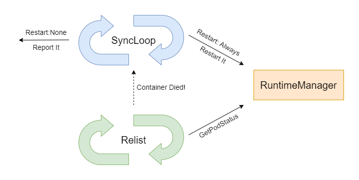

### 5.2 CNI

本项目中，选用的CNI插件为weave，将对CNI的调用集成到Pod功能中。在 `RuntimeManager` 创建Pod时，会调用 `weave attach` 为Pause容器赋予IP，由于共享网络命名空间，最后所有容器都拥有这一IP。

在多机场景下，新机器需要调用 `weave connect` 加入weave集群，此后通过 `weave attach` 赋予的IP将在所有工作节点中可见。

### 5.3 Service抽象

Service是某一组Pod所暴露的网络服务的抽象，当用户在集群内创建一个Service后，能够通过其虚拟IP访问到真实网络服务。这一抽象屏蔽了网络服务具体提供者的IP等信息，由Kubeproxy负责管理。

Service的配置文件内容包括：Service名称，标签选择器，类型（支持ClusterIP和NodePort），一组虚拟端口与对应的真实端口。示例如下：

```yaml
kind: Service
apiVersion: v1
metadata:
  name: nginx-service
spec:
  type: NodePort
  ports:
    - port: 800
      targetPort: 1024
      nodePort: 30080
  selector:
    app: nginx
```

创建Service的请求到达apiserver后，apiserver会在一个预留网段（100.0.0.0/24）的IP池中为其分配一个ClusterIP。具体实现方式是在etcd中持久化一个bitmap，每个bit对应IP池中的一个IP的占用情况，分配时通过bitmap找到一个可用IP并翻转对应bit即可。

本项目中，Kubeproxy利用Linux IPVS进行流量转发。首先，Kubeproxy在启动时会进行必要的初始化，为的是IPVS的流量转发功能能够在每种使用场景下均正确生效，场景包括Pod互访，宿主机访问Pod，Pod访问自身。具体配置参考了文章https://zhuanlan.zhihu.com/p/431571642 。等效命令如下（内核模块和系统参数的作用比较冗长，不再赘述）：

```bash
modprobe br_netfilter
ip link add dev minik8s-dummy type dummy // 每增加一个虚拟IP，都绑定到该设备上
sysctl --write net.bridge.bridge-nf-call-iptables=1
sysctl --write net.ipv4.ip_forward=1
sysctl --write net.ipv4.vs.conntrack=1
```

IPVS进行流量转发的基本概念是Virtual Server和Real Server，与Service抽象高度重合。为Service（的一个Port）配置规则时，Virtual Server设为ClusterIP:Port, 其目的地Real Server则设置为该Service所有Endpoint的PodIP:TargetPort。支持NodePort时，只需额外添加一个Virtual Server，即HostIP:NodePort，其目的地Real Server与前述一致。

Service的负载均衡策略同样由IPVS提供，本项目中选用Round Robin。

综上，示例Service对应的IPVS规则应当如下图所示：

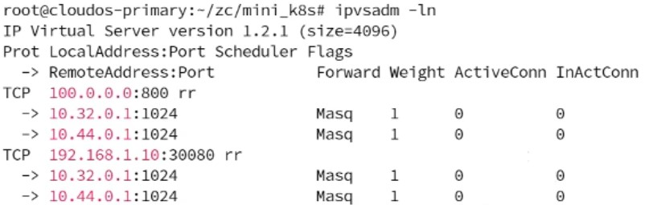

与Kubelet类似，Kubeproxy会定期向控制面询问集群中的所有Service和Pod，根据标签选择器，以及Pod的容器暴露的端口，计算出每个Service的所有Endpoint，并与本地最新缓存进行比较。发现本地版本落后，需要更新本地IPVS规则时，调用封装好的IPVS接口进行更新。

### 5.4 ReplicaSet抽象

ReplicaSet是一种副本控制器，主要作用是控制由其管理的 Pod，使 Pod 的可用副本的数量始终维持在预设的个数。ReplicaSet通过标签选择器确定它管理哪些Pod。

Replicaset的配置文件包括ReplicaSet名称，副本的数量，标签选择器，Pod数量不足时添加Pod的模板。示例如下：

```yaml
kind: ReplicaSet
apiVersion: v1
metadata:
  name: nginx-replicaset
  namespace: default
spec:
  replicas: 2
  selector:
    matchLabels:
      app: nginx
  template:
    metadata:
      name: nginx-pod
      namespace: default
      labels:
        app: nginx
    spec:
      containers:
        - name: container
          image: python:latest
          ports:
            - containerPort: 1024
              protocol: tcp
```

创建ReplicaSet的请求到达apiserver后，apiserver会将ReplicaSet数据存储在etcd中。ReplicaSetController则轮询集群中所有ReplicaSet和Pod，根据标签选择器计算可用Pod数量。如果Pod数量超过副本数，则向apiserver发送删除对应pod的请求；如果Pod数量不足，则向apiserver发送增加ReplicaSet中template的pod请求。

计算当前Pod数量时，状态为 `Failed` 的Pod将会被忽略。这样，当有 Pod 异常退出时，ReplicaSet也会做出响应，添加新的Pod。

### 5.5 动态扩缩容

此处的扩缩容指的是HorizonalPodAutoscaling，即通过增加某种类型的pod数量来应对资源指标的变化。

HPA是基于ReplicaSet实现的，即当HPAController基于Pod的指标认为Pod数量需要改变的时候，会通过接口改变相对应的ReplicaSet Spec中的replicas数量。

下面简单介绍HPA的api对象字段。

```yaml
kind: HorizontalPodAutoscaler
apiVersion: v1
metadata:
  name: test-hpa
spec:
  scaleTargetRef:
    kind: ReplicaSet
    name: nginx-replicaset
    namespace: default
  minReplicas: 1
  maxReplicas: 3
  scaleWindowSeconds: 20
  metrics:
    - name: cpu
      target:
        type: Utilization
        averageUtilization: 50
        upperThreshold: 80
        lowerThreshold: 20
    - name: memory
      target:
        type: AverageValue
        AverageValue: 100
  behavior:
    scaleUp:
      type: Pods
      value: 1
      periodSeconds: 60
    scaleDown:
      type: Pods
      value: 1
      periodSeconds: 60
```

- spec.scaleTargetRef：和HPA绑定的ReplicaSet
  - name，namespace：确定了唯一的ReplicaSet
- minReplicas，maxReplicas：HPA规定的扩缩容上下限
- scaleWindowSeconds：在同一个窗口期内最多出现一次扩缩容
- metrics支持对cpu和memory进行统计
  - target支持两种类型：
  - Utilization：使用率，有对应的上下界upperThreshold/lowerThreshold
  - AverageValue：使用量，这里memory对应的单位是MB
- behavior支持scaleUp和scaleDown
  - value：一次扩/缩容最多改变多少个Pod
  - periodSeconds：只考虑这个时间范围内的历史数据，在时间范围外的数据不纳入考量

实现HPA，主要分为三个部分：kubelet集成的cAdvisor采集，上传到控制面并且保存，HPAController从控制面获取历史数据。

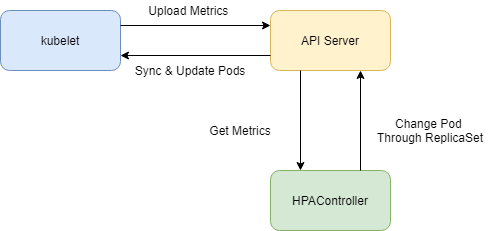

kubelet集成的cAdvisor采集需要启动cAdvisor容器，定期检查cAdvisor的可用性以及上传数据。

控制面自行实现了一个简单的TSDB（时序数据存储），超过有效期的数据会被无效化。

HPAController会定期从控制面获取需要的指标源数据，并且根据一定策略决定是否扩缩容。

HPAController的具体流程：

1. 定期依照HPA中含有的ReplicaSet筛选出需要监控的Pod
2. 以当前时间之前的periodSeconds为时间界限，从控制面获得Pod的历史数据
3. 计算使用量的平均值
4. 根据阈值计算判断是否有必要扩缩容
5. 如果需要扩缩容，和上次成功扩缩容是否在同一个时间窗口内，若在同一个窗口内则不做操作
6. 默认选择各种策略中使得最终改变量最大的策略

改变ReplicaSet的预期数量后，ReplicaSet会自行管理Pod的增减。

### 5.6 DNS与转发

本项目中，DNS这一api对象有两大功能，一是支持将自定义的域名解析到指定的Service，二是在此基础上支持同一域名的不同路径可以对应到不同Service。

DNS的配置文件内容包括：DNS名称，DNS规则（包括域名，子路径对应的后端service）。示例如下：

```yaml
apiVersion: v1
kind: DNS
metadata:
  name: my-dns
spec:
  rules:
    - host: myservice.com
      paths:
        - path: /nginx
          backend:
            service:
              name: nginx-service
              port: 800
        - path: /python
          backend:
            service:
              name: python-service
              port: 900
```

为了支持自定义的DNS解析，在工作节点的宿主机上需要启动coredns，并指定其作为Pod和宿主机的DNS服务器（通过修改Pod和宿主机的`/etc/resolv.conf`文件实现），同时需要启动nginx服务。Kubeproxy会通过轮询apiserver，找到最新配置，并基于此动态地修改二者的配置文件，使DNS可用。如下图所示，一个通过DNS api对象自定义的域名会被解析到nginx监听的IP地址，而nginx会进一步根据路径匹配，将流量分发到不同service后端。

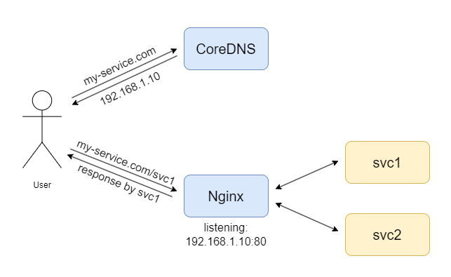

coredns配置方式如下，增加域名时往`/etc/coredns/hosts`中写入新条目即可：

```
. {
    //自定义hosts
    hosts /etc/coredns/hosts {
        fallthrough
    } 
    // 没找到则转发给jcloud dns服务器
    forward . 202.120.2.100 202.120.2.101 
    log
    errors
}
```

nginx配置方式如下，增加域名时在`/etc/nginx/conf.d`中新建一个配置文件：
```
server {
    listen 80; // http默认80端口
    server_name my-service.com; // 域名
    location /svc1 {
        proxy_pass http://100.0.0.0:8080/; //转发给具体Service
    }
    location /svc2 {
        ...
    }
}
```

在实现微服务时，由于微服务通常的使用方法是使用服务名作为域名，故在创建 Service 时，还会添加一条 ServiceName 到 ServiceIP 的 DNS 解析配置。这样，应用除了使用 ServiceIP，还可以通过 `ServiceName:Port/path` 来访问具体Service。

### 5.7 容错

本项目中，要求控制面重启对集群中的Pod和Service均无影响。为此，在控制面和工作节点的实现中，分别采取了以下思路：
* 控制面的所有组件均实现为无状态的。
	* apiserver本身不保存任何会话信息，提供无状态的Restful API。
	* 其他控制面组件在轮询apiserver的过程中，除了中间计算结果，没有任何需要存储在内存中的状态。重启最多导致一次中间计算结果的丢失。
	* 所有api对象的配置与状态数据全部持久化在etcd中。
* 工作节点在无法连接到控制面时，总是尝试维持节点状态为已知最新的期望状态，而不是回收本节点上的资源。

### 5.8 多机

本项目支持多个工作节点同时运行，在 Kubelet 启动时，可以通过 `-j` 参数指定控制面节点的 IP，通过 `-c` 参数指定本地 Node 配置文件（可选），在启动时将自身注册到 apiserver 中，此后 scheduler 将会开始往这个新节点调度 Pod。当 Kubelet 退出后，也会解除自身节点的注册，原来被调度到该节点的 Pod 会回到 Unscheduled 状态，可被再次调度。

由于 Scheduler 的 NodeAffinity 策略只需要考虑 Node 的 `label`， 而其他策略与节点配置无关，故 Node 的配置文件较为简单，仅包含 `kind, apiVersion, metadata` 三个字段。

由于 weave CNI 插件已经支持了多机集群，故在多机场景下，Service 的实现无需调整，即可在不同节点上访问同一 Service 下的任何 Pod，而无需关心其运行位置。

### 5.9 MicroService

#### 5.9.1 流量劫持与转发

为了使Envoy能够在Pod内部进行流量劫持，需要在Pod网络命名空间内配置iptables规则。参考istio的实现，在nat表中添加四条链（前缀为 `MISTIO`）和一些路由规则，如下图所示：

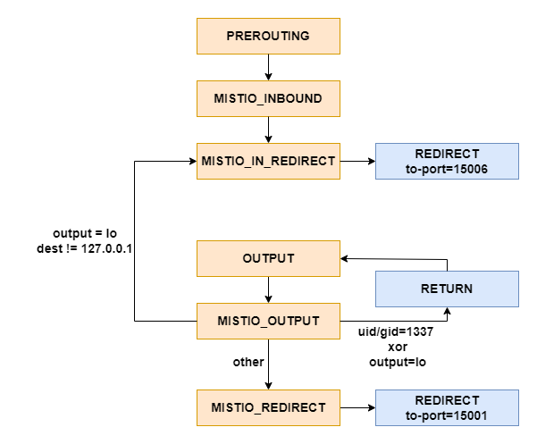

配置完毕后，所有入站流量会被重定向到15006端口，出站流量会被重定向到15001端口，这两个端口均被Envoy监听。有几种特殊情况：

* 为了避免死循环，即Envoy自己劫持自己的出站流量，Envoy进程将会被赋予一个独特的uid（1337），在iptables中指定，对于uid或gid=1337的出站流量，不做任何处理。
* 当流量从lo网卡输出时：如果地址不是回环地址，表明这是一个Pod内部使用非回环地址的互访（例如，目的地址为CNI赋予的本地PodIP），该流量需要被视为进站流量并劫持。如果地址是回环地址，表明应用程序清楚自己需要访问本地端口，对该流量不做任何处理。

由于 iptables 规则必须由 root 用户配置，所以这一过程需要在一个特权 initContainer 中完成（即配置文件中指定 `privileged = true`）。

目前支持的流量类型为 http 流量。Envoy 的相应端口获取到出/入站http请求后，会读取 http 报文中的 Host 和 URL，根据从pilot获取到的 `SidecarMapping`，使用加权随机或URL正则匹配算法，决定流量的实际目的地，并启动一个 http 反向代理（golang 内置的 `httputil.ReverseProxy`）服务该请求。

要为 Pod 注入 Envoy，需要进行如图红框所示的修改，其中 envoy 和 envoy-init 镜像均为自行制作，Dockerfile 位于 `cmd/envoy` 和 `cmd/envoyinit` 目录下：

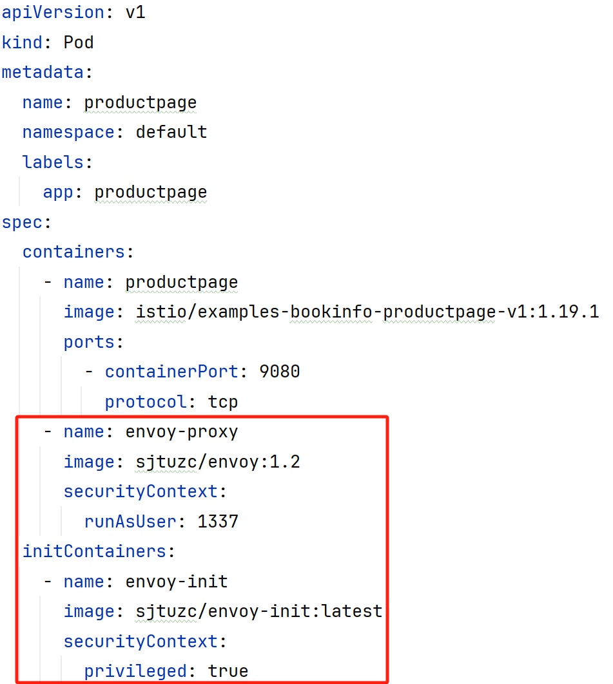

#### 5.9.2 流量转发控制

本项目通过 VirtualService 和 Subset 两个api对象进行流量转发控制。

VirtualService的配置文件主要包括：VirtualService名称，管理的Service名称及其端口，包含的Subset及其权重或URL。权重和URL只能同时指定一种。示例如下:

```yaml
apiVersion: v1
kind: VirtualService
metadata:
  name: nginx-vs
  namespace: default
spec:
  serviceRef: nginx-service
  port: 802
  subsets:
    - name: nginx-v1
      weight: 1
    - name: nginx-v2
      weight: 2
```

Subset的配置文件主要包括：Subset名称和管理的pod。示例如下：

```yaml
apiVersion: v1
kind: Subset
metadata:
  name: nginx-v1
  namespace: default
spec:
  pods:
    - nginx-pod-1
    - nginx-pod-2
```

pilot会持续监听存储在 etcd 内的 VirtualService，Subset 和 Service，并且根据配置计算出被 VirtualService 管理的 Service 的流量按照何种权重或URL匹配转发到每个 Endpoint。如果指定根据权重分配流量，每个 Subset 的权重最终会被计算为每个 Endpoint 的权重（例如 Subset 权重为 `[1, 2]`, Subset 大小为 `[2, 1]`, 最终的权重配比将是`[1, 1, 4]`）。此外，还会计算其他未被 VirtualService 管理的 Service 的转发方式，此时所有 Endpoint 具有默认的相等权重。上述计算结果称为 `SidecarMapping` ，也就是 `(ServiceIP, Port)->[(PodIP, TargetPort, Weight/URL)]` 的映射，存储在 etcd 中，供每个 Envoy 获取。


#### 5.9.3 灰度发布

有了上文提到的 VirtualService + Subset两个api对象，用户可以自行实现服务的灰度发布：

* 首先，定义服务新旧版本各自的 Subset，如subset-v1，subset-v2。
* 在灰度发布的不同阶段，创建不同的 VirtualService，按需调整每个 Subset 的权重（或URL），达到灰度发布的目的。

#### 5.9.4 滚动升级

滚动升级的配置文件内容包括：名称，管理的Service端口，Pod最小存活数，升级间隔时间，升级目标Pod Spec。示例文件如下：

```yaml
apiVersion: v1
kind: RollingUpdate
metadata:
  name: my-ru
spec:
  serviceRef: reviews
  port: 9080
  minimumAlive: 1
  interval: 15
  newPodSpec:
    containers:
      - name: reviews
        image: istio/examples-bookinfo-reviews-v3:1.19.1
        ports:
          - containerPort: 9080
            protocol: tcp
      - name: envoy-proxy
        image: sjtuzc/envoy:1.2
        securityContext:
          runAsUser: 1337
    initContainers:
      - name: proxy-init
        image: sjtuzc/envoy-init:latest
        securityContext:
          privileged: true
```

执行滚动升级时，每次会删除 `total - minimumAlive` 个 Pod，并基于新的 Pod Spec重新添加。同时，通过前述流量控制方式，通过创建 Subset 并设置权重为0，阻止流量到达正在升级中的 Pod。删除和创建后均会等待 `0.5 * interval` 秒，确保服务有足够时间启动。

## 6. 个人作业

### 6.1 持久化存储

持久化存储功能位于分支 `feature/pv`。

本项目中的持久化存储基于 PersistentVolume 以及 PersistentVolumeClaim 两个抽象实现。其中 PV 代表的是真实存储资源，而 PVC 代表对真实资源的申领，创建 PVC 后，其将会与集群中可用且符合要求的 PV 进行绑定。Pod可以通过指定 PVC 名称挂载其绑定的 PV。

PV配置文件包括：PV名称，容量，存储类名称（本项目中，对k8s中的存储类概念进行了简化，暂时仅支持一种存储类 `nfs`，其制备方法集成在代码逻辑中）。示例如下：

```yaml
apiVersion: v1
kind: PersistentVolume
metadata:
  name: test-pv
  namespace: default
spec:
  capacity: 1Gi
  storageClassName: nfs
```

PVC配置文件包括：PVC名称，要求容量，存储类名称。示例如下：

```yaml
apiVersion: v1
kind: PersistentVolumeClaim
metadata:
  name: test-pvc-1
  namespace: default
spec:
  request: 500Mi
  storageClassName: nfs
```

PVC与PV的绑定有两种方式：一是根据存储类名称和要求容量，在集群中与已创建的符合要求的PV绑定；二是当集群中不存在符合要求的PV时，根据存储类名称动态创建PV。当前本项目默认支持了 `nfs` 存储类。

PV和PVC的管理由 PVController 负责。PVController将会轮询集群中的PV和PVC，进行以下操作：
* 对于已创建，处于 `Pending` 状态的 PV，在本节点上为其创建目录，并通过修改 `/etc/exports` 文件，运行 `exportfs -ra` 将其导出，可以供任意内网节点通过 nfs client 挂载。此时 PV 状态转变为 `Available`。
* 对于已创建，处于 `Pending` 状态的 PVC，寻找所有处于 `Available` 状态的 PV，与其绑定。此时二者状态都变为 `Bound`，且会将双向绑定关系存入二者的 `Status` 字段。若找不到符合条件的 PV，则尝试创建一个，等待下次轮询时再绑定。
* 对于删除的 PVC，将其 PV 状态重新变为 `Available`。

若要创建一个挂载持久卷的Pod，配置文件如下所示：

```yaml
apiVersion: v1
kind: Pod
metadata:
  name: pvc-pod
  namespace: default
spec:
  containers:
    - name: c1
      image: alpine:latest
      volumeMounts:
      - name: pv
        mountPath: /mnt/pv
  volumes:
    - name: pv
      persistentVolumeClaim:
        claimName: test-pvc-1
```

Pod创建时，指定的 PVC 必须已处于 `Bound` 状态。Kubelet将会为与该存储卷创建一个宿主机临时目录，并使用 `mount -t nfs` 挂载 nfs server 导出的路径到宿主机。随后，再通过docker sdk将该宿主机目录挂载进Pod。Pod被删除时，使用 `umount` 解除挂载后，再清除本地目录，避免 PV 的实际资源被删除。挂载关系如图所示：

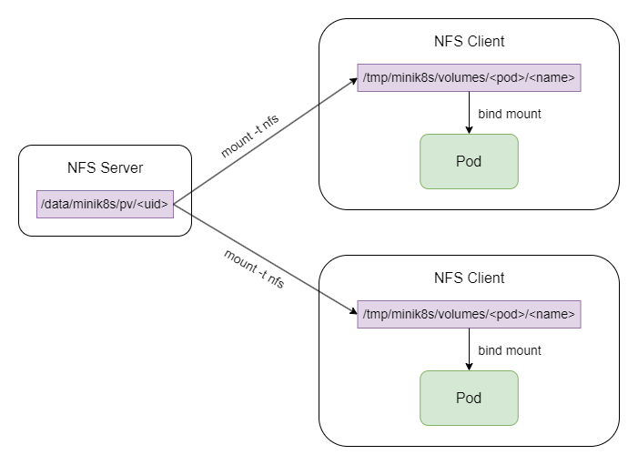

这样，就可以实现一个集群级别的持久化存储。Pod删除或退出后，由于 nfs server 目录仍被持久化保存，可以将 PV 重新绑定到其他 Pod，而不会丢失 PV 存储的数据。

### 6.2 GPU

GPU任务的实现参考了k8s中的Job类，Job的配置文件内容包括：Job的名字，gpu具体配置需求，cuda程序位置。实例文件如下:

```yaml
kind: Job
metadata:
  name: gpujob
spec:
  partition: dgx2
  threadNum: 1
  taskPerNode: 1
  cpu_per_task: 6
  gpu-num: 1
  file: result
  codePath: /root/tz/localdesk/mini_k8s/scripts/data/add.cu
```

创建Job的请求到达apiserver后，apiserver会将Job数据存储在etcd中。JobController则监听环境中的Job数量，根据未分配的Job生成对应的脚本，进行文件传输和创建对应的Pod，发送创建Pod的请求到apiserver上，创建的Pod执行sbatch命令，并且返回gpu运算任务的结果，以JobStatus的形式由apiserver存储到etcd中。

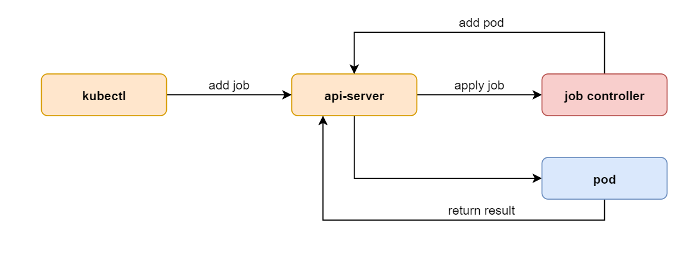

需要查看gpu job运行结果，则使用指令：

```
$ ./bin/kubectl get job jobname
```

### 6.3 集群监控

集群监控功能位于分支 `feature/prometheus`

功能基于prometheus动态读取配置文件来实现。

```yaml
# my global config
global:
  scrape_interval: 10s # Set the scrape interval to every 10 seconds.
  evaluation_interval: 10s # Evaluate rules every 10 seconds. 

# A scrape configuration containing exactly one endpoint to scrape:
scrape_configs:
  # The job name is added as a label `job=<job_name>` to any timeseries scraped from this config.
  - job_name: "cadvisor"
    file_sd_configs:
      - files:
        - ../../mini_k8s/cmd/stats-controller/test/nodes/*.yml
        refresh_interval: 10s
    
  - job_name: "diy"
    file_sd_configs:
      - files:
        - ../../mini_k8s/cmd/stats-controller/test/pods/*.yml
        refresh_interval: 10s
```

指定两个job，会从指定的路径中获取所有的yml文件。yml文件中包含prometheus可以刮削的/metrics路径，格式为

```yaml
- targets: 
  - 192.168.1.10:8090
```

StatsController会定期轮询apiServer，获取其想要的Node和Pod信息，在指定路径生成相关的配置文件。

**针对所有Node的监听**：

只需定期从apiserver中获取所有node的信息，而由于每个node上都有cAdvisor，并且暴露8090端口，所以可以通过cAdvisor的接口获取各个Node的配置信息和负载。

Grafana可以参考原K8s的设计，保证Node能够被某些字段唯一标识即可，这里实现用的是Node Internel IP。

**针对Pod自定义指标的监听：**

使用python程序，需要引入prometheus_client指定自定义指标，暴露相应的metrics端口。

将python脚本打包到python镜像中，设置启动参数和暴露端口，可以通过指定镜像的方式来启动pod。

```yaml
kind: Pod
apiVersion: v1
metadata:
  name: prome-pod
  namespace: default
  labels:
    app: prome
    monitor: prometheus
    monitorPort: "32001"
spec:
  containers:
    - name: container
      image: lzl-prome:latest
      ports:
        - containerPort: 32001
          protocol: tcp
```

和监控相关的字段是`labels`中的`monitor`和`monitorPort`，只有`monitor`存在，且`monitor = "prometheus"` 才会监听相关的`monitorPort`.


